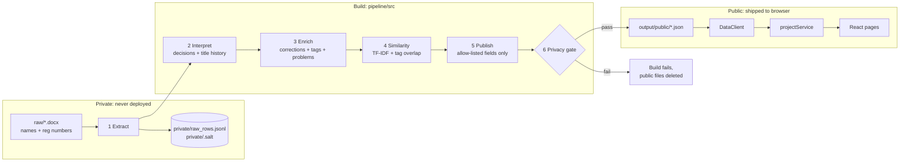

# DIT Project Discovery: Data System

This repository turns DIT project-title documents (Word files listing students and titles) into a clean, private, browser-friendly dataset for the React prototype.

Run `python3 pipeline/src/build.py` to rebuild the data; it also copies the result into `app/public/data/`. The web app lives in `app/` (see `app/README.md`).

## 1. The core idea: two worlds that never mix

Student names and registration numbers exist only in `raw/` and `private/`, and both are git-ignored. Two layers keep them out of the website:

1. **Allow-list publishing.** Public records are built field by field from an explicit list. No code path copies a name or registration number.
2. **Privacy gate.** After writing, every public file is scanned for registration numbers, any 9+ digit sequence, any two consecutive tokens of a real student name, and forbidden field names such as `name` or `regNo`. Any hit fails the build and deletes the public output. The gate caught two false positives during development, which showed it was strict enough.

Students are linked across rows (for example, a rejected first title and an accepted second one) with a salted HMAC key. The key is used internally and never published.

## 2. What the documents actually contain

| | 2017/18 | 2018/19 | 2019/20 | 2025/26 |
|---|---|---|---|---|
| Header | "Project presentation, tentative titles" | "Project titles" (3 tables) | "Final presentation, Aug 2020" | DIT Electrical Eng., BENG 22 EE, title defence |
| People columns | ADM. NO., NAMES, Supervisors (all empty) | NAME, REG (empty) | NAME (empty) | REG NO, NAME (filled; never published) |
| Decisions | none | none | none (presented, so inferred accepted) | 10 remark spellings |
| Quirks | several alternative titles in one cell; placeholders "Changed title" | unlabelled serial column; words glued together ("AUTOMATICCIRCUIT") | year labels like "(2018/2019)"; serials missing | one row can hold two different projects |
| Projects | 200 | 142 | 133 | 277 |

**Institution warning:** none of the three older documents mention DIT. The 2017/18 list names "Mbeya University of Science and Technology" outright, and all three reference the MUST library, canteen, computer lab and parking, plus Mbeya-area sites (VETA Busokelo, Mbalizi, Iwambi, Iyunga, Songwe airport). They are published as `institutionId: "unconfirmed"`. Once their origin is confirmed, changing it is a one-line config edit per document.

## 3. Pipeline stages

| Stage | File | What it does |
|---|---|---|
| 1 Extract | `extract.py` | Reads Word tables, handles merged cells and extra columns, records the table and row of every value. Output is private. |
| 2 Interpret | `interpret.py` | Turns rows into project submissions, parses remarks into decisions, merges duplicate rows, detects serial gaps. |
| 3 Enrich | `enrich.py` | Fixes spelling, builds display titles, and derives problems, categories, domains, technologies and places from the title. |
| 4 Similarity | `similarity.py` | Precomputes the top six similar projects for each project, with reasons. |
| 5 Publish | `build.py` | Writes sharded JSON, a manifest with hashes, and a quality report. |
| 6 Privacy gate | `privacy.py` | Fails the build if personal data leaks. |

### How one row becomes one or two projects (2026 layout)

| REMARKS | Original TITLE | NEW TITLE |
|---|---|---|
| Accepted / recast / with condition | Accepted (recorded) | Same project if the titles overlap (≥25%): stored as the approved wording. Otherwise a separate submission, flagged for review. |
| Rejected / Absent / Pending / blank | As recorded | Same project if the titles overlap ≥50% (a rewording). Otherwise a **second proposal**, decision *not recorded*. |
| 2nd title accepted (with condition) | Rejected (*inferred*) | Second proposal, **accepted** (recorded) |

Every decision carries `decisionProvenance: "recorded" | "inferred"`, so the UI never presents a guess as a fact.

### Multi-line cells and glued words

A line break in a title cell is either a wrapped title ("...Alert System For / Excessive Dust...") or a separate alternative title ("Energy saving solar tracker / Fastest Auto Selection of any Available Phase..."). `split_alternatives` splits only when the new line starts like a fresh title and the previous line doesn't end in a connector word or comma. It handles all 10 real multi-line cells correctly. Alternatives become separate projects linked to each other.

`GlueSplitter` repairs words fused by missing spaces. It learns vocabulary from all titles and splits a rare token only if every piece (3+ letters, or OF/ON/IN/TO/AT/BY) is common elsewhere. Real compounds are protected by `keepWords` in `corrections.json`, plus the system hunspell dictionary when one is installed. An early version split MICROPROCESSOR into "MICRO PROCESS OR"; the keep-list and minimum piece length now prevent that. Every split is recorded on the record.

### What "processing" adds, and what it deliberately doesn't

| Field | Source | Provenance label |
|---|---|---|
| Title, original wording, remarks | Document | `recorded` |
| Spelling fixes and glued-word repairs (189 applied) | `config/corrections.json` | each fix listed on the record |
| Problems (49), categories (14), domains (11), technologies (42), places | Rules in `config/*.json` matched against the title | `derived-from-title` |
| Problem description | Written once per *problem class*, not per project | `general-problem-description` |
| Solution summary | **Not generated.** A title can't tell us what was built. | `not-available` |
| Year annotations such as "(2014/2015)" | Kept verbatim; meaning unknown | stored in `annotations` |

Problem descriptions describe the general problem (for example, "smallholders lose crops after harvest"). They never make claims about what a specific student built. That is how the platform gains rich context without fabricating historical data.

## 4. Public dataset (`output/public/`)

| File | Size | Loaded |
|---|---|---|
| `manifest.json` | <1 KB | First, always |
| `projects.index.json` | 353 KB (43 KB gzipped) for 752 projects | With the first screen: titles, years, decisions, tag IDs |
| `problems.json`, `taxonomy.json`, `sources.json` | 27 KB | With the first screen |
| `projects.<sourceId>.json` | 230–510 KB each | Lazily, when a project from that document is opened |
| `search.json` | 20 KB | Lazily, only for "check my idea" |

Project IDs are content hashes (`p2026-48ed9384`), so they stay the same across rebuilds and URLs never break.

## 5. Loading without failing (`app/src/data/`)

| Risk | Defence |
|---|---|
| Large data slows startup | Data is fetched, not bundled. The app shell paints immediately, and only ~45 KB gzipped is needed for the first screen. |
| Stale mix after redeploy | `?v=<datasetVersion>` from the manifest is appended to every file URL. |
| Slow or failed network | 10 s timeout, two retries with backoff, shared in-flight requests. |
| One malformed record | Runtime validation skips and counts it. It never throws in a render. |
| Data format changes | `schemaVersion` check returns a clear "update the app" error. |
| Errors reach users | Every call returns `Result<T>`. `useResource` gives pages loading, error and retry states. |

`projectService.ts` is the only module pages call. Its functions are async and API-shaped (`queryProjects`, `getProject`, `getProblem`, `checkIdea`, `getInsights`). In Phase 5, replace their bodies with `fetch('/api/...')` and no page changes.

Tests (`app/tests/dataLayer.test.ts`, 15 passing) cover search, Swahili synonyms, filters, lazy details, idea checking, alternative-title linking, and the failure modes: network loss with recovery, corrupt records, timeouts, and unknown IDs.

## 6. Adding the next document

1. Put the `.docx` in `raw/`.
2. Add an entry to `config/sources.json`: year, programme, event, column names. A new column layout needs a small branch in `interpret.py`.
3. Run `python3 pipeline/src/build.py`.
4. Read `reports/quality-report.json`. Fix unclassified titles by adding patterns to `config/problems.json`, and add new spelling fixes to `config/corrections.json`.
5. The build copies `output/public/*` into `app/public/data/` automatically.

Domain knowledge lives in the JSON config, so a lecturer can improve classification without touching code.

## 7. Scaling limits

The index grows about 0.5 KB per project. Up to roughly 5,000 projects (about ten years across all programmes), this design works unchanged. Beyond that, shard the index by year, or move search to the backend planned for Phase 5.

## 8. Findings from the data so far

- **Repeated topics are common, and the committee notices.** 24 of 277 titles from 2026 closely match a title from 2018–2020. 13 of those 24 were rejected (54%), against 35% rejection overall.
- **The "(2018/2019)" labels in the 2020 list are probably not carried-over students.** Only 3 of 16 match a title in that year's list. Annotated titles do have a close earlier match 6× more often than unannotated ones (3/16 vs 3/103), which fits "marked as previously done in year X". Suggestive, not proven.

## 9. Open questions

1. Are the 2017/18, 2018/19 and 2019/20 documents from MUST? If yes: drop them, or support multiple institutions now (the data model already has `institutionId`).
2. What do the "(2014/2015)"-style labels mean? Ask whoever kept the 2020 list.
3. May rejected titles be shown publicly? (`publishRejectedTitles` in `sources.json`)
4. Do DIT title lists exist for 2019–2025? They would add the most value, because that is the period current students compete with.
5. Can supervisors or students contribute short solution summaries? This is the only honest way to fill `solutionSummary`.
